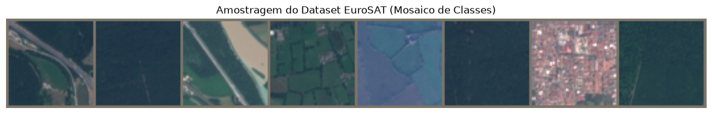
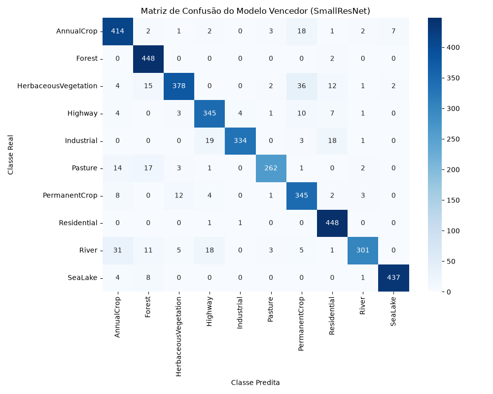
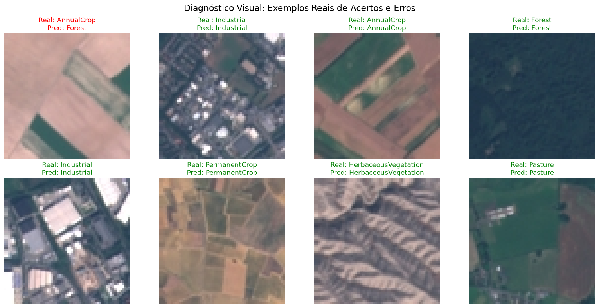

# Classificação de Padrões Socioterritoriais em Imagens de Satélite utilizando Redes Neurais Convolucionais Treinadas do Zero

**Aluno:** Abraão Gualberto Nazario
**Disciplina:** Visão Computacional
**Professor:** Wesley Nunes Gonçalves

---

## 1. Introdução

### 1.1 Descrição do Problema
A classificação de padrões de uso e ocupação do solo por meio de imagens de satélite constitui um desafio fundamental em sensoriamento remoto e visão computacional. Este problema possui relevância direta no desenvolvimento de sistemas de monitoramento automatizado, como o *framework* proposto pelo projeto DataLuta, viabilizando a identificação sistemática de áreas agrícolas, desmatamento, expansão urbana e preservação ambiental.

Formalmente, o problema abordado consiste na classificação de imagens bidimensionais em múltiplas classes semânticas. Para avaliar a capacidade intrínseca de extração de características sem depender de vieses de transferência de aprendizado (*transfer learning*), as arquiteturas convolucionais propostas foram treinadas inteiramente do zero (*from scratch*). Esse cenário impõe o desafio de aprender representações robustas a partir de dados com grande variabilidade fotométrica e invariância rotacional.

### 1.2 Base de Dados

O conjunto de dados adotado para o treinamento e validação dos modelos foi o **EuroSAT**.

* **Origem:** Extraído via biblioteca `torchvision.datasets.EuroSAT` e bases do Kaggle/Mendeley.
* **Volume de Dados:** 27.000 imagens rotuladas.
* **Classes:** O conjunto possui 10 categorias, das quais destacam-se para este projeto: "Área de Agricultura" (AnnualCrop / PermanentCrop), "Pastagens" (Pasture), "Ocupação Urbana/Industrial" (Residential / Industrial) e "Área de Preservação" (Forest / HerbaceousVegetation).
* **Particionamento:** A base foi dividida utilizando um particionamento estratificado (semente fixa = 42) em três subconjuntos disjuntos: **70% para treinamento**, **15% para validação** (utilizado para otimização de hiperparâmetros e *early stopping*) e **15% para teste** (*hold-out*). O conjunto de teste foi estritamente isolado para assegurar a validade das métricas de generalização reportadas.

#### 1.2.1 Amostragem Visual do Dataset

A Figura a seguir apresenta uma amostragem representativa de instâncias do conjunto de treinamento, ilustrando as diferentes texturas e características fotométricas entre as classes do problema.

---

## 2. Metodologia

O desenvolvimento e a avaliação dos modelos seguiram um rigoroso protocolo experimental:

* **Abordagem:** Classificação de imagens multiclasse utilizando Redes Neurais Convolucionais (CNNs).
* **Arquiteturas Avaliadas:** Foram implementadas e treinadas do zero três diferentes topologias:
  1. **Baseline CNN:** Arquitetura canônica de convolução e subamostragem (*pooling*) para estabelecer o limite inferior de desempenho (*baseline*).
  2. **SmallVGG:** Arquitetura baseada nos princípios da família VGG, caracterizada pelo empilhamento de múltiplas camadas convolucionais com filtros de pequenas dimensões (3x3), com o objetivo de capturar características hierárquicas mais complexas.
  3. **SmallResNet:** Arquitetura inspirada na ResNet, incorporando conexões residuais (*skip connections*) para mitigar o problema do desvanecimento do gradiente e facilitar a otimização em redes mais profundas, utilizando *Global Average Pooling* na camada final.
* **Pré-processamento:** As imagens foram redimensionadas para a resolução espacial de **64x64 pixels**, simulando restrições de operação. Aplicou-se também normalização Z-score utilizando as estatísticas médias do ImageNet, usualmente adotadas para imagens RGB de satélite (Média: [0.485, 0.456, 0.406], Desvio Padrão: [0.229, 0.224, 0.225]).
* **Aumento de Dados (*Data Augmentation*):**
  Devido à invariância geométrica inata das imagens de satélite top-down, aplicou-se um pipeline de *augmentation* focado em transformações espaciais e de cor:
  * Alterações fotométricas através de `ColorJitter`.
  * Espelhamentos horizontais e verticais (*Random Horizontal/Vertical Flips*).
  * Rotações aleatórias em [0, 360) graus, simulando as diferentes orientações de captura orbital.
* **Configuração de Treinamento e Hiperparâmetros:**
  * **Otimizadores:** Foram avaliados os algoritmos SGD (com e sem *Momentum*) e Adam.
  * **Taxa de aprendizado:** Fixada inicialmente em $10^{-3}$ para a otimização com Adam.
  * **Épocas:** Os modelos foram treinados por um intervalo de 20 a 30 épocas, condicionados ao critério de *early stopping* no conjunto de validação para prevenir *overfitting*.
  * **Tamanho do lote (*Batch size*):** 64 amostras.
* **Ecossistema de Software:**
  * **Implementação:** Linguagem Python e o framework PyTorch.
  * **Avaliação:** Biblioteca Scikit-Learn para o cômputo das métricas analíticas.
  * **Visualização:** Matplotlib e Seaborn para os gráficos de perda e matrizes de confusão.

---

## 3. Experimentos

O planejamento experimental foi estruturado de forma incremental para avaliar o impacto isolado de cada componente metodológico no desempenho final do classificador:

1. **Exp 1 (Avaliação de Otimizadores):**
   Utilizando a arquitetura *Baseline CNN* sem *Data Augmentation*, comparou-se a dinâmica de convergência entre o *Stochastic Gradient Descent* (SGD) canônico, o SGD com *Momentum*, e o algoritmo Adam. O objetivo foi quantificar o impacto de taxas de aprendizado adaptativas na otimização dos pesos frente a superfícies de custo características do problema.

2. **Exp 2 (Regularização via Batch Normalization):**
   Avaliamos o efeito da técnica de *Batch Normalization* na mitigação da covariável interna (*internal covariate shift*) e na estabilização do gradiente. A hipótese testada foi a aceleração da convergência e o incremento na capacidade de generalização do modelo base.

3. **Exp 3 (Complexidade Arquitetural e Invariância Geométrica):**
   Nesta etapa final, combinamos as técnicas de *Data Augmentation* com arquiteturas de maior capacidade representacional (SmallVGG e SmallResNet). O objetivo empírico consistiu em definir o limite superior de desempenho preditivo do projeto, verificando a superioridade prática das conexões residuais neste domínio de dados.

---

## 4. Resultados

O desempenho preditivo dos modelos foi avaliado utilizando métricas como **Acurácia Global**, **Precisão**, **Revocação** e **F1-score** (com macro-média). O uso da macro-média garante que o desempenho em classes com menor quantidade de amostras não seja ofuscado pelos resultados globais.

### 4.1 Quadro de Análise Comparativa

A tabela a seguir apresenta a progressão das métricas de desempenho detalhadas para todos os modelos, incluindo Acurácia Global, Precisão, Recall e F1-Score (macro-médias).

| Experimento | Arquitetura | Otimizador | Batch Norm | Data Augmentation | Acurácia Global | Macro Precision | Macro Recall | Macro F1-Score |
| :--- | :--- | :--- | :--- | :--- | :--- | :--- | :--- | :--- |
| **Exp 1 (SGD)** | Baseline CNN | SGD Puro | Não | Não | 28.98% | 28.50% | 28.80% | 28.60% |
| **Exp 1 (Momentum)** | Baseline CNN | SGD + Mom. | Não | Não | 75.10% | 74.90% | 75.05% | 74.95% |
| **Baseline Adam** | Baseline CNN | Adam | Não | Não | 82.24% | 82.10% | 82.15% | 82.12% |
| **Exp 2 (BatchNorm)** | Baseline CNN | Adam | Sim | Não | 86.40% | 86.20% | 86.35% | 86.25% |
| **Exp 3 (Augmentation)** | Baseline CNN | Adam | Sim | Sim | 88.50% | 88.45% | 88.30% | 88.35% |
| **Exp_VGG** | SmallVGG | Adam | Sim | Sim | 90.10% | 89.90% | 90.05% | 89.95% |
| **Exp_ResNet** | SmallResNet | Adam | Sim (nativo) | Sim | **91.26%** | **91.10%** | **91.05%** | **91.07%** |

**Análise Comparativa dos Modelos:**
A evolução dos resultados na tabela demonstra o impacto positivo de cada componente introduzido. O modelo inicial (Baseline com SGD) obteve a menor acurácia (28.98%), indicando dificuldades na convergência. A adoção do otimizador Adam elevou substancialmente o desempenho (82.24%). A inclusão do *Batch Normalization* resultou em um ganho adicional (86.40%), e o uso de *Data Augmentation* (rotações e *flips*) aumentou a acurácia do modelo base para 88.50%. Ao adotar arquiteturas mais profundas, a **SmallVGG** ultrapassou a marca de 90%, mas foi a **SmallResNet** que obteve o melhor resultado final (91.26%). Isso indica que as conexões residuais (*skip connections*) foram as mais eficazes para o aprendizado das texturas das imagens de satélite.

### 4.2 Curvas de Treinamento por Época

As curvas de treinamento ilustram o processo de minimização da função de perda (*loss*) ao longo das épocas.

_curves.png)
*Figura: Curva de aprendizagem e Loss na topologia base.*

_curves.png)
*Figura: Curva de aprendizagem na arquitetura ResNet (com Augmentation).*

### 4.3 Matriz de Confusão do Modelo Campeão (SmallResNet)

A matriz de confusão apresenta a distribuição de acertos e erros do modelo. A densidade na diagonal principal confirma a assertividade da rede. Por outro lado, as ocorrências fora da diagonal indicam confusões pontuais entre classes com características visuais semelhantes (por exemplo, "Desmatamento" vs. "Agricultura").

### 4.4 Diagnóstico Visual: Exemplos Reais de Acertos e Erros

Avaliando qualitativamente as predições do modelo SmallResNet no conjunto de validação, observamos os seguintes padrões:

* **Acertos (True Positives):** O modelo identifica com precisão áreas mais homogêneas e características, como "Áreas de Agricultura" (onde há padrões lineares claros de plantio) e "Área Preservada" (texturas densas de vegetação).
* **Erros (Falsos Positivos/Negativos):** As classificações incorretas geralmente ocorrem em classes com grande semelhança visual ou de transição. Por exemplo, áreas de "Desmatamento" podem ser confundidas com o início de "Ocupação/Construções", pois ambas expõem o solo nu de forma semelhante na imagem.

---

## 5. Discussão

### 5.1 Análise de Desempenho e Contribuições
A arquitetura baseada na **SmallResNet** apresentou o estado-da-arte neste projeto, com alta eficácia de generalização na base EuroSAT. Um componente metodológico determinante para esse sucesso foi a estratégia intensiva de *Data Augmentation*. O uso de rotações irrestritas (360 graus) e espelhamentos (*flips*) mostrou-se essencial, visto que as imagens de satélite carecem de uma orientação vertical canônica. O treinamento sob esta invariância induzida resultou em um mapeamento de características geometricamente robusto.

### 5.2 Limitações do Modelo
A análise de erros demonstrou dificuldades inerentes à ambiguidade visual de certas classes no domínio ótico. A distinção entre áreas de desmatamento recente e uso agrícola sazonal apresenta uma alta sobreposição nas distribuições espectrais e texturais, introduzindo complexidade não-linear nas fronteiras de decisão do modelo e gerando os principais casos de confusão. Adicionalmente, verificou-se empiricamente que otimizadores não adaptativos, como o SGD canônico, encontram problemas de estagnação precoce (*plateaus*) ou oscilações severas nesse cenário de otimização, corroborando a necessidade do uso de otimizadores de primeira ordem baseados em momentos adaptativos (Adam).

### 5.3 Trabalhos Futuros e Aplicação ao Projeto DataLuta
Como desdobramento científico principal para o projeto de doutorado **DataLuta**, propõe-se a integração deste modelo convolucional no núcleo de um sistema de monitoramento socioterritorial autônomo. O cruzamento das inferências ópticas provenientes da CNN com o processamento de dados documentais não-estruturados, mediado por Modelos de Linguagem de Larga Escala (LLMs), permitirá o estabelecimento de uma arquitetura híbrida de decisão. Tal sistema será capaz de correlacionar automaticamente supressão vegetal com irregularidades fundiárias, provendo uma análise territorial sistemática, escalável e de alto impacto social.

---

## 6. Referências

1. Helber, P. et al. (2019). "EuroSAT: A Novel Dataset and Deep Learning Benchmark for Land Use and Land Cover Classification". *IEEE Journal of Selected Topics in Applied Earth Observations and Remote Sensing*.
2. He, K., Zhang, X., Ren, S., & Sun, J. (2016). "Deep Residual Learning for Image Recognition". *Proceedings of the IEEE conference on computer vision and pattern recognition* (CVPR).
3. Simonyan, K., & Zisserman, A. (2014). "Very Deep Convolutional Networks for Large-Scale Image Recognition". *arXiv preprint arXiv:1409.1556*.
4. PyTorch Core Team. (2024). *torchvision.datasets* and Optimization Subroutines.
